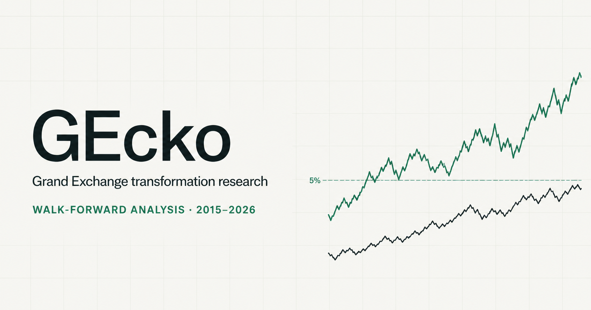

# GEcko

GEcko is a statistical arbitrage research project based on the Old School
RuneScape Grand Exchange. I built it to test whether prices for raw materials
and processed items move together in a stable and tradeable way.

The project covers data collection, pair screening, rolling diagnostics,
walk-forward signal fitting, backtesting, transaction costs, capacity limits,
lookahead checks, and a small machine learning comparison.

**[Open the live dashboard](https://gecko-research-dashboard.greenwoodtom.chatgpt.site)**

**[Read the full methodology](docs/Methodology.md)**

[](https://gecko-research-dashboard.greenwoodtom.chatgpt.site)

## Main result

The strongest relationship was between cowhide and leather.

Both price series are individually stationary, or I(0). This means the result
is not a textbook case of cointegration between two I(1) series. I describe it
as a stable mean-reverting relationship instead.

| Check | Result |
|---|---|
| Data coverage | More than 4,000 daily observations from March 2015 to June 2026 |
| Rolling stability | The relationship passed the 5% threshold in 99% of 111 two-year windows |
| Hedge ratio | 0.80 to 1.07 across rolling windows |
| Spread half-life | About 13 days |
| Realistic annual return | 35.1% after tax and measured spread costs |
| Sharpe ratio | 0.80 after realistic costs |
| Maximum drawdown | 59.0% |
| Deflated Sharpe probability | 89.8% after correcting for eight screened pairs |
| Lookahead audit | No structural violations across 3,328 scored days |
| Estimated capacity | About 728,000 gp before some entries require more than one buy-limit window |

The return is not the only result that matters. The drawdown is large and the
capacity is small. I report both because they limit how the backtest should be
interpreted.

## Why use the Grand Exchange

The Grand Exchange is useful for this study for three reasons.

1. Raw materials and processed items have a clear economic link.
2. The sell tax and item buy limits are known.
3. Long daily price histories are available for research.

The market does not allow short selling, so the backtest uses a long-only
rotation. It switches between the raw and processed item rather than taking a
traditional long and short pair position.

## Research process

1. Download daily guide prices and recent high and low trade prices.
2. Build aligned daily panels without using future data to fill gaps.
3. Screen eight economically linked item pairs.
4. Run integration, Engle-Granger, Johansen, and rolling-window checks.
5. Fit an Ornstein-Uhlenbeck model on a trailing 730-day window.
6. Refit every 30 days and hold the fitted parameters fixed between refits.
7. Trade a fixed z-score rule with hysteresis.
8. Apply the 2% sell tax and measured half-spread costs.
9. Correct the Sharpe result for the number of pairs screened.
10. Audit the fitted dates and independently recompute sampled refits.
11. Measure how Grand Exchange buy limits restrict starting capital.
12. Compare the OU signal with logistic regression and gradient boosted trees.

## Results that did not work

- Iron looked strong in the full sample but passed only 52% of rolling windows.
- Rune became more stable after 2019 but lost money after trading costs.
- Logistic regression underperformed the OU baseline.
- Gradient boosted trees traded too often and lost almost all capital after
  costs.
- Capacity became a problem above about 728,000 gp.

These negative results are kept in the project because they show where the
method failed and why candidates were rejected.

## Limits

- This is a study of a game economy, not a real financial market.
- The strategy is long-only because Grand Exchange items cannot be shorted.
- Daily prices do not show intraday queue position or partial fills.
- Measured spread costs come from a shorter recent sample and are applied to
  the longer backtest.
- The result is capacity constrained and is not suitable for large capital.
- The dashboard and backtest are research tools, not a live trading system.

## Repository layout

```text
gecko/
  data/                 Data cleaning and alignment
  stats/                Statistical tests and OU fitting
  backtest/             Backtest, risk, audit, and capacity code
  ml/                   Features and walk-forward classifiers

tests/                  Python test suite
data/raw/               Committed source data used by the study
data/clean/             Clean panels and model outputs
data/screen/            Pair screening results
figures/                Figures produced by the Python pipeline
docs/Methodology.md     Full methodology and result tables
dashboard/              Interactive dashboard source and frontend tests

data_pull.py            Data collection
screen_pairs.py         Initial pair screen
build_clean_panels.py   Causal cleaning and alignment
run_*.py                Remaining research stages
```

The data and figures are committed on purpose. The recent trade-price API keeps
only a limited rolling history, so keeping the exact research inputs makes the
reported results reproducible.

## Run the Python project

Python 3.12 is used in continuous integration.

```bash
python -m venv .venv
python -m pip install -r requirements.txt
python -m pytest -q
```

The research scripts can then be run in this order.

```bash
python data_pull.py
python screen_pairs.py
python build_clean_panels.py
python run_cointegration.py
python run_rolling_diagnostics.py
python run_ou_signal.py
python run_naive_backtest.py
python run_lookahead_audit.py
python run_buy_limit_check.py
python run_ml_signal.py
```

The raw data needed to reproduce the existing analysis is already committed.
Running `data_pull.py` is only needed when refreshing the source data.

## Run the dashboard

Node.js 22 is used in continuous integration.

```bash
cd dashboard
npm install
npm run dev
```

To check the production build locally, run:

```bash
npm run lint
npm test
```

## Technology

- Python
- pandas and NumPy
- statsmodels
- scikit-learn
- pytest
- React and TypeScript
- vinext and Cloudflare Workers
